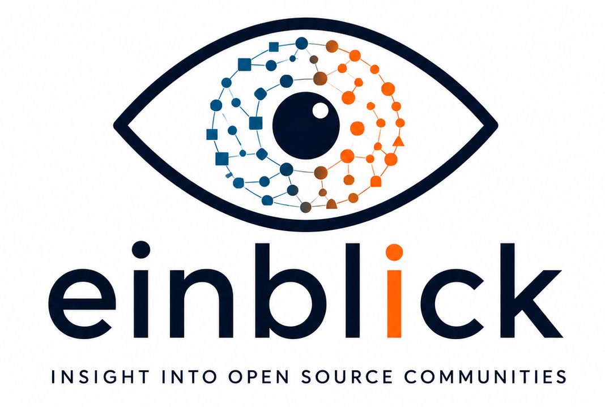

<div align="center">



# Einblick

*Evidence-based contributor fitness signals for open-source projects.*

[](LICENSE)
[](go.mod)
[](cmd/einblick)
[](internal/github)
[](https://github.com/Embedded-Focus/einblick/commits/main)

**[Usage](#usage)** ·
**[Authentication](#authentication)** ·
**[Development](#development)** ·
**[Architecture](#architecture)**

</div>

**Einblick** (German for "insight") helps contributors evaluate open-source projects using transparent measurements of responsiveness, participation and engineering activity.

This project is early. The initial executable skeleton fetches GitHub repository metadata and reports one demonstrator metric: the number of open pull requests returned by the first GitHub API page. Measurements are evidence, not definitive judgments about a project or its maintainers.

## Usage

```console
einblick analyze labgrid-project/labgrid
einblick analyze labgrid-project/labgrid --format json
einblick analyze https://github.com/labgrid-project/labgrid
einblick compare labgrid-project/labgrid jumpstarter-dev/jumpstarter
einblick version
```

`compare` is intentionally present but not implemented in milestone one.

## Authentication

Einblick discovers GitHub credentials in this order:

1. `--token`
2. `EINBLICK_GITHUB_TOKEN`
3. `GITHUB_TOKEN`
4. unauthenticated access

Tokens are used only for GitHub API authentication and are not printed in output or errors.

## Development

Prerequisites:

- Go 1.24 or newer
- `golangci-lint`

Common commands:

```console
gofmt -w .
go test ./...
go test -race ./...
go vet ./...
golangci-lint run
CGO_ENABLED=0 go build -trimpath ./cmd/einblick
```

Release builds can inject build metadata:

```console
go build -trimpath -ldflags "-s -w -X github.com/einblick/einblick/internal/buildinfo.Version=v0.1.0 -X github.com/einblick/einblick/internal/buildinfo.Commit=$(git rev-parse --short HEAD) -X github.com/einblick/einblick/internal/buildinfo.Built=$(date -u +%Y-%m-%dT%H:%M:%SZ)" ./cmd/einblick
```

## Architecture

Einblick uses a small ports-and-adapters layout:

- `cmd/einblick`: process entry point
- `internal/cli`: command parsing and exit-code mapping
- `internal/app`: analysis orchestration
- `internal/forge`: provider-neutral domain types and provider port
- `internal/github`: GitHub REST adapter and API mapping
- `internal/metrics`: metric definitions and calculators
- `internal/report`: terminal and JSON renderers
- `internal/buildinfo`: linker-injected version information

Metric calculators work on provider-neutral data. They must document their population, calculation and caveats, and they should include focused tests.
